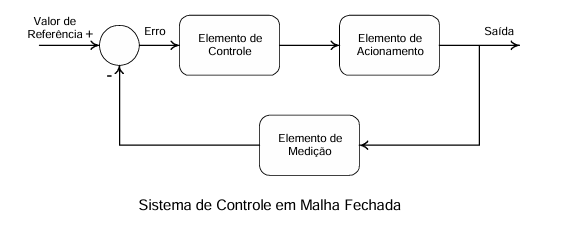

# Identificação de Processos e Sintonia de Controladores PID
**C13 - Sistemas Embarcados**
Projeto Prático 1

**Grupo 2** · Planta: **Motor CC (controle de velocidade)** 
            · Métodos de sintonia: **Ziegler-Nichols Malha Aberta** e **Cohen-Coon**
            · Critério de desempenho: **menor tempo de resposta**

## Proposta 

A aplicação identifica o modelo de um motor CC a partir de um ensaio de curva de reação (resposta ao degrau em malha aberta), sintoniza controladores PID por métodos clássicos e permite ao usuário testar a malha fechada em uma interface gráfica com login, seleção de método de sintonia, sintonia manual e métrica de desempenho (tempo de subida, tempo de acomodação e overshoot).

## Parte teórica

### 1. Funcionamento da planta

*Figura 1: Sistema de controle em malha fechada. Fonte: FUENTES (2005).*

O motor CC é bastante usado em acionamentos de velocidade variável justamente pela facilidade de controlar sua rotação e seu torque (FUENTES, 2005). Ele é formado por uma parte fixa, o **estator**, que gera o fluxo magnético principal $\Phi$, e uma parte girante, a **armadura**, alimentada por escovas e comutador. A interação entre o campo do estator e a corrente da armadura produz o torque que gira o eixo, e o comutador garante que esse torque mantenha sempre o mesmo sentido.

Considerando excitação independente ou ímãs permanentes, o fluxo $\Phi$ é constante, e a velocidade passa a ser controlada pela tensão aplicada na armadura (FUENTES, 2005). Nessa condição, o motor pode ser resumido em duas relações:

$$T = K_t\,I_a \qquad\qquad E = K_e\,\omega$$

O torque é proporcional à corrente de armadura, e a **força contraeletromotriz** $E$ é proporcional à velocidade. É ela que faz a resposta se estabilizar: conforme o motor acelera, $E$ aumenta, a corrente e o torque diminuem, e a velocidade para de crescer quando o torque equilibra as perdas e a carga.

Incluindo a indutância da armadura $L_a$, a inércia $J$ e o atrito viscoso $b$, o modelo dinâmico do motor é de segunda ordem (OGATA, 2010):

$$\frac{\Omega(s)}{V_a(s)} = \frac{K_t}{(L_a s + R_a)(J s + b) + K_t K_e}$$

Um polo vem da parte elétrica ($L_a/R_a$) e o outro da parte mecânica ($J/b$). Como a constante elétrica é muito mais rápida, a dinâmica mecânica domina, e o motor pode ser aproximado por um modelo de **primeira ordem com atraso**:

$$G(s) = \frac{k}{\tau s + 1}\,e^{-\theta s}$$

O atraso $\theta$ não aparece nas equações ideais do motor. Em um sistema real, ele vem de fatores como o tempo de amostragem do controlador, a filtragem da medição e o atrito estático. Já a constante de tempo identificada, de cerca de 20 s, é alta para um motor pequeno, o que indica um motor acionando uma carga com bastante inércia.

## Referências

FUENTES, Rodrigo Cardozo. **Apostila de Automação Industrial**: capítulo 5 – Controle de Motores de Corrente Contínua. Santa Maria: Colégio Técnico Industrial de Santa Maria, Universidade Federal de Santa Maria, 2005.

OGATA, Katsuhiko. **Engenharia de Controle Moderno**. 5. ed. São Paulo: Pearson Prentice Hall, 2010.
